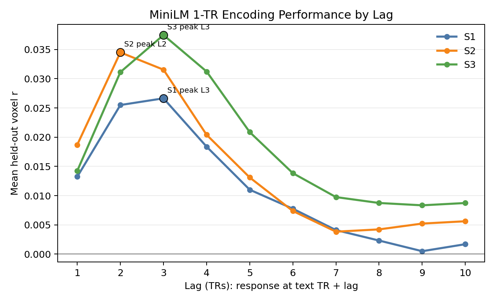

# Peak Lag Analysis

This note summarizes the first lag-preference encoding experiment. The goal was
to ask when a short semantic representation of the text is most predictive of
frontal fMRI responses.

For each subject and each lag from 1 to 10 TRs, we trained a separate ridge
encoding model:

```text
X = MiniLM embedding of the words in one 1-TR text window at chunk i
Y = full_frontal voxel response at TR i + lag
```

The model was fit on story-grouped training stories and evaluated on held-out
stories. The saved score is Pearson `r` between predicted and true held-out
responses, separately for every full-frontal voxel.

## Command

The per-subject lag runs were produced with:

```bash
cd /ceph/behrens/ellie/language-decoding-expts

for SUB in S1 S2 S3; do
  python lag_preference_analysis/train_lag_encoding.py \
    --subject "$SUB" \
    --lags 1 2 3 4 5 6 7 8 9 10
done
```

The main outputs are:

```text
lag_preference_analysis/results/<SUB>__embedding__lags1-10__chunk1tr__seed0/
├── lag_corrs.npz      # corrs[n_lags, n_full_frontal_voxels]
├── lag_summary.csv    # aggregate r statistics by lag
└── per_lag/           # one npz per lag
```

## Tuning Curve

The plot below shows the mean held-out voxel `r` across all full-frontal voxels
as a function of lag.



## Peak Lags

| Subject | n full-frontal voxels | peak lag | peak mean r | peak median r | peak p95 r | voxels r > 0.1 at peak | voxels r > 0.2 at peak |
|---|---:|---:|---:|---:|---:|---:|---:|
| S1 | 20,551 | 3 | 0.0266 | 0.0191 | 0.1040 | 1,158 | 41 |
| S2 | 28,673 | 2 | 0.0345 | 0.0231 | 0.1304 | 2,976 | 252 |
| S3 | 26,713 | 3 | 0.0375 | 0.0248 | 0.1412 | 3,194 | 296 |

## Full-Frontal Mean r By Lag

| Subject | lag 1 | lag 2 | lag 3 | lag 4 | lag 5 | lag 6 | lag 7 | lag 8 | lag 9 | lag 10 |
|---|---:|---:|---:|---:|---:|---:|---:|---:|---:|---:|---:|
| S1 | 0.0132 | 0.0255 | 0.0266 | 0.0184 | 0.0110 | 0.0078 | 0.0041 | 0.0023 | 0.0005 | 0.0017 |
| S2 | 0.0187 | 0.0345 | 0.0315 | 0.0204 | 0.0131 | 0.0074 | 0.0038 | 0.0042 | 0.0052 | 0.0056 |
| S3 | 0.0142 | 0.0311 | 0.0375 | 0.0312 | 0.0209 | 0.0138 | 0.0098 | 0.0087 | 0.0083 | 0.0087 |

## Interpretation

All three subjects show the same broad tuning shape: prediction rises sharply
from lag 1 to lag 2/3, then decays across later lags. This is what we would
expect if the BOLD response to local semantic content is delayed by a few TRs.

The peak is not identical across subjects:

- `S1` peaks at lag 3, with lag 2 almost tied.
- `S2` peaks at lag 2.
- `S3` peaks at lag 3 and has the strongest overall full-frontal signal.

The early peak is also clear in the high-performing voxel counts. At peak lag,
the number of voxels with `r > 0.1` is much larger than at later lags, while
`r > 0.2` voxels are concentrated almost entirely at lags 2-3.

This analysis uses one-TR MiniLM windows, so it is specifically measuring the
lag preference for very local semantic information. It does not test longer
context or summary features; those were handled separately in the summary-combo
encoding analyses.
