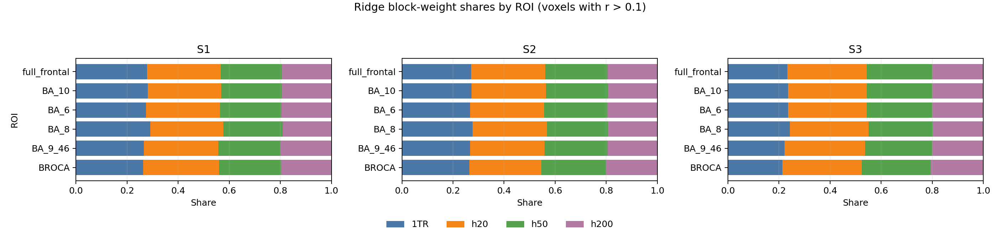
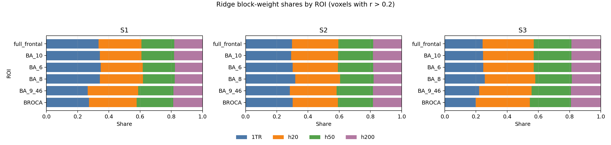
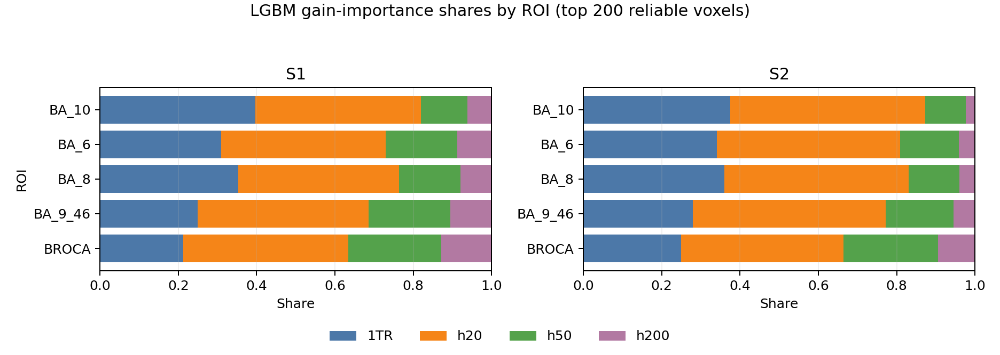

# Regressor Block Size By Region

This note summarizes a ridge coefficient-size analysis for the summary-combo
encoding model. The combo model used four equal-size MiniLM feature blocks:

```text
1TR local text | h20 summary | h50 summary | h200 summary
384 dims       | 384 dims    | 384 dims    | 384 dims
```

For each subject, the lag-2 combo ridge model was refit with a fixed
`alpha=100000`, matching the modal/highest selected alpha from the original
combo runs. The analysis script z-scored text features and voxel responses,
then computed the L2 norm of the ridge coefficient vector within each feature
block for each voxel.

The run was:

```bash
cd /ceph/behrens/ellie/language-decoding-expts

for SUB in S1 S2 S3; do
  TAG=${SUB}__embedding-summary-combo-h20-50-200__lags1-10__chunk1tr__seed0

  python lag_preference_analysis/analyze_combo_regressor_blocks.py \
    --results-dir lag_preference_analysis/results/$TAG \
    --subject "$SUB" \
    --lags 2 \
    --ridge-alphas 100000 \
    --out-csv lag_preference_analysis/results/$TAG/combo_regressor_block_norms_lag2_alpha100000.csv
done
```

A thresholded version of the same output was also used to inspect only voxels
with strong encoding performance. The tables below show the `r > 0.1`
(`subset=r_ge_0p1`) and `r > 0.2` (`subset=r_ge_0p2`) subsets. Values are mean
coefficient-norm fractions:

```text
block_fraction = block_l2_norm / (1TR_l2 + h20_l2 + h50_l2 + h200_l2)
```

Because the feature blocks are correlated, these fractions should be read as
how ridge distributes standardized coefficient mass, not as a clean causal
variance partition.

## Ridge Visual Summary

These stacked bars show the same coefficient-norm fractions as the tables.
Each row sums to 1.0 within an ROI.





## S1, Lag 2, Voxels With r > 0.1

| ROI | n voxels | 1TR | h20 | h50 | h200 | largest block |
|---|---:|---:|---:|---:|---:|---|
| full_frontal | 1,983 | 0.278 | 0.289 | 0.238 | 0.195 | h20 |
| BA_10 | 972 | 0.282 | 0.287 | 0.236 | 0.195 | h20 |
| BA_6 | 356 | 0.275 | 0.289 | 0.241 | 0.196 | h20 |
| BA_8 | 282 | 0.290 | 0.286 | 0.232 | 0.191 | 1TR |
| BA_9_46 | 250 | 0.266 | 0.292 | 0.244 | 0.198 | h20 |
| BROCA | 123 | 0.263 | 0.297 | 0.242 | 0.198 | h20 |

## S2, Lag 2, Voxels With r > 0.1

| ROI | n voxels | 1TR | h20 | h50 | h200 | largest block |
|---|---:|---:|---:|---:|---:|---|
| full_frontal | 4,628 | 0.271 | 0.291 | 0.244 | 0.195 | h20 |
| BA_10 | 2,057 | 0.272 | 0.292 | 0.242 | 0.194 | h20 |
| BA_6 | 902 | 0.267 | 0.289 | 0.247 | 0.197 | h20 |
| BA_8 | 794 | 0.276 | 0.292 | 0.239 | 0.193 | h20 |
| BA_9_46 | 628 | 0.267 | 0.291 | 0.246 | 0.195 | h20 |
| BROCA | 247 | 0.264 | 0.282 | 0.254 | 0.201 | h20 |

## S3, Lag 2, Voxels With r > 0.1

| ROI | n voxels | 1TR | h20 | h50 | h200 | largest block |
|---|---:|---:|---:|---:|---:|---|
| full_frontal | 4,793 | 0.234 | 0.310 | 0.256 | 0.200 | h20 |
| BA_10 | 1,777 | 0.236 | 0.308 | 0.255 | 0.201 | h20 |
| BA_6 | 1,203 | 0.235 | 0.309 | 0.255 | 0.200 | h20 |
| BA_8 | 825 | 0.242 | 0.309 | 0.250 | 0.198 | h20 |
| BA_9_46 | 775 | 0.222 | 0.315 | 0.262 | 0.201 | h20 |
| BROCA | 213 | 0.214 | 0.310 | 0.270 | 0.206 | h20 |

## S1, Lag 2, Voxels With r > 0.2

| ROI | n voxels | 1TR | h20 | h50 | h200 | largest block |
|---|---:|---:|---:|---:|---:|---|
| full_frontal | 157 | 0.334 | 0.275 | 0.211 | 0.181 | 1TR |
| BA_10 | 86 | 0.343 | 0.266 | 0.210 | 0.181 | 1TR |
| BA_6 | 15 | 0.349 | 0.269 | 0.206 | 0.176 | 1TR |
| BA_8 | 37 | 0.342 | 0.276 | 0.205 | 0.177 | 1TR |
| BA_9_46 | 15 | 0.264 | 0.323 | 0.226 | 0.186 | h20 |
| BROCA | 4 | 0.273 | 0.305 | 0.234 | 0.187 | h20 |

## S2, Lag 2, Voxels With r > 0.2

| ROI | n voxels | 1TR | h20 | h50 | h200 | largest block |
|---|---:|---:|---:|---:|---:|---|
| full_frontal | 673 | 0.298 | 0.296 | 0.224 | 0.182 | 1TR |
| BA_10 | 337 | 0.293 | 0.300 | 0.224 | 0.183 | h20 |
| BA_6 | 137 | 0.302 | 0.290 | 0.226 | 0.183 | 1TR |
| BA_8 | 115 | 0.318 | 0.288 | 0.215 | 0.179 | 1TR |
| BA_9_46 | 67 | 0.283 | 0.299 | 0.233 | 0.184 | h20 |
| BROCA | 17 | 0.302 | 0.290 | 0.224 | 0.184 | 1TR |

## S3, Lag 2, Voxels With r > 0.2

| ROI | n voxels | 1TR | h20 | h50 | h200 | largest block |
|---|---:|---:|---:|---:|---:|---|
| full_frontal | 908 | 0.243 | 0.327 | 0.241 | 0.189 | h20 |
| BA_10 | 297 | 0.245 | 0.326 | 0.240 | 0.189 | h20 |
| BA_6 | 257 | 0.247 | 0.324 | 0.241 | 0.189 | h20 |
| BA_8 | 196 | 0.257 | 0.323 | 0.233 | 0.186 | h20 |
| BA_9_46 | 130 | 0.220 | 0.337 | 0.251 | 0.192 | h20 |
| BROCA | 28 | 0.199 | 0.346 | 0.264 | 0.191 | h20 |

## LGBM Block Importance

We also ran a voxel-sampled LightGBM block-importance analysis for S1 and S2:

```bash
python lag_preference_analysis/analyze_combo_lgbm_blocks.py \
  --results-dir lag_preference_analysis/results/$TAG \
  --subject "$SUB" \
  --lag 2 \
  --top-n-per-roi 200 \
  --n-estimators 80 \
  --max-depth 3 \
  --learning-rate 0.03 \
  --n-jobs 4 \
  --out-prefix lag_preference_analysis/results/$TAG/combo_lgbm_block_importance_lag2_top200
```

This is not a coefficient-norm analysis. LightGBM has no linear coefficients,
so the table reports each block's share of summed split **gain importance**.
The sampled voxels are the top 200 reliable voxels per ROI. I found S1 and S2
outputs in the mounted results tree; the equivalent S3 top-200 LGBM summary was
not present.



### S1 LGBM, Lag 2, Top 200 Voxels Per ROI

| ROI | n voxels | 1TR | h20 | h50 | h200 | largest block | mean LGBM val r | mean saved ridge best-r |
|---|---:|---:|---:|---:|---:|---|---:|---:|
| BA_10 | 200 | 0.396 | 0.423 | 0.119 | 0.061 | h20 | 0.180 | 0.204 |
| BA_6 | 200 | 0.310 | 0.420 | 0.182 | 0.088 | h20 | 0.129 | 0.155 |
| BA_8 | 200 | 0.353 | 0.411 | 0.158 | 0.079 | h20 | 0.142 | 0.164 |
| BA_9_46 | 200 | 0.249 | 0.437 | 0.209 | 0.105 | h20 | 0.109 | 0.141 |
| BROCA | 200 | 0.212 | 0.422 | 0.237 | 0.129 | h20 | 0.087 | 0.117 |

### S2 LGBM, Lag 2, Top 200 Voxels Per ROI

| ROI | n voxels | 1TR | h20 | h50 | h200 | largest block | mean LGBM val r | mean saved ridge best-r |
|---|---:|---:|---:|---:|---:|---|---:|---:|
| BA_10 | 200 | 0.375 | 0.498 | 0.103 | 0.024 | h20 | 0.227 | 0.263 |
| BA_6 | 200 | 0.341 | 0.467 | 0.150 | 0.042 | h20 | 0.196 | 0.222 |
| BA_8 | 200 | 0.361 | 0.470 | 0.129 | 0.040 | h20 | 0.191 | 0.219 |
| BA_9_46 | 200 | 0.280 | 0.493 | 0.173 | 0.055 | h20 | 0.169 | 0.196 |
| BROCA | 200 | 0.250 | 0.415 | 0.241 | 0.094 | h20 | 0.125 | 0.150 |

## Main Pattern

Among the best-predicted voxels (`r > 0.2`), the model shifts away from the
very flat block fractions seen across all full-frontal voxels. `h200` is
consistently the smallest block, while `1TR` and `h20` carry most of the
coefficient mass.

There is subject variability:

- S1 high-r voxels are mostly `1TR`-dominant, except BA_9/46 and Broca, where
  `h20` is largest.
- S2 is mixed: BA_8/BA_6/Broca lean more local, while BA_10 and BA_9/46 lean
  slightly toward `h20`.
- S3 is strongly `h20`-dominant across every ROI, with Broca also showing the
  largest `h50` share of the three subjects.
- The `r > 0.1` ridge subset is smoother and more stable than `r > 0.2`, but
  shows the same broad story: `h20` is usually largest, `h200` is smallest, and
  Broca/BA_9_46 tend to give relatively more weight to `h50` than BA_8/BA_10.
- The LGBM gain analysis is more decisive than ridge: `h20` is the largest
  block for every available ROI in both S1 and S2. This is expected because
  trees tend to concentrate gain on the most useful correlated block, whereas
  ridge spreads coefficient mass across correlated features.

Overall, the high-r voxel analysis supports the same qualitative conclusion as
the broader ridge and LGBM analyses: the useful contextual signal is mostly
short-context enrichment (`h20`) plus local text (`1TR`), not a dominant
long-summary (`h200`) representation.
